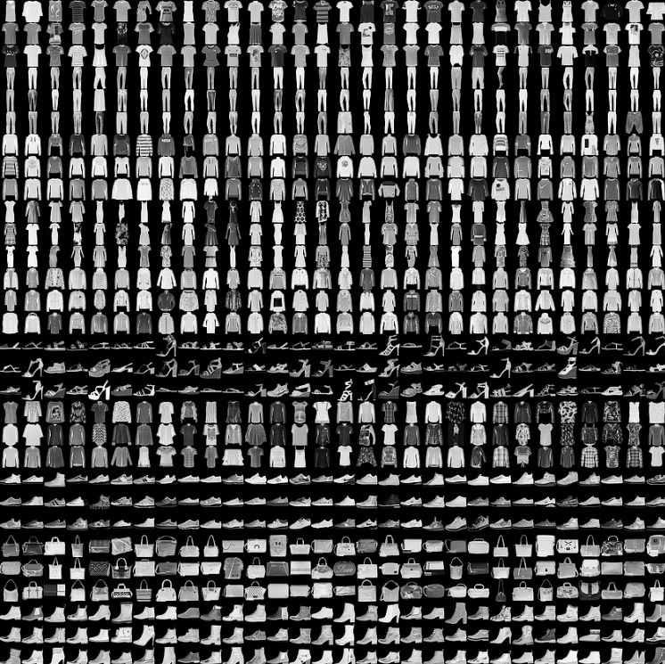
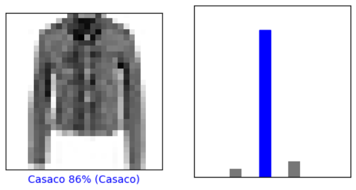

# Classificação de Imagens Fashion MNIST com TensorFlow e Keras



Este repositório contém um projeto simples de classificação de imagens usando TensorFlow e Keras para o conjunto de dados Fashion MNIST. O conjunto de dados Fashion MNIST é frequentemente usado como um substituto para o conjunto de dados MNIST tradicional e consiste em imagens em escala de cinza de 10 itens de vestuário diferentes. Neste projeto, construiremos uma rede neural para classificar esses itens.

## Começando
### Pré-requisitos
Antes de começar, certifique-se de ter o seguinte instalado:

- Python
- TensorFlow
- NumPy
- Matplotlib

Você pode instalar os pacotes necessários usando o pip:

```
pip install tensorflow numpy matplotlib
```

## Uso
Para executar o código, siga estas etapas:

Clone este repositório em sua máquina local.

```
git clone https://github.com/yourusername/fashion-mnist-classification.git
```

Mude para o diretório do projeto.

```
cd fashion-mnist-classification
```

Execute o código em seu ambiente Python.

```
python fashion_mnist_classification.py
```

O script fará o download do conjunto de dados Fashion MNIST, processará os dados, construirá uma rede neural, treinará o modelo e avaliará sua precisão.

## Descrição
Aqui está uma visão geral dos principais componentes do código:

- Importe as bibliotecas necessárias: TensorFlow, Keras, Matplotlib e NumPy.

- Carregue o conjunto de dados Fashion MNIST usando o Keras.

```
f_mnist = keras.datasets.fashion_mnist
(train_images, train_labels), (test_images, test_labels) = f_mnist.load_data()
```

- Defina os nomes das classes para os 10 diferentes itens de vestuário.

```
class_names = ['Camiseta', 'Calça', 'Suéter', 'Vestido', 'Casaco',
               'Sandálias', 'Camisa', 'Tênis', 'Bolsa', 'Botas']
```

- Pré-processe as imagens escalando os valores dos pixels para uma faixa entre 0 e 1.

```
train_images = train_images / 255.0
test_images = test_images / 255.0
```

- Crie um modelo de rede neural usando o Keras. O modelo consiste em uma camada Flatten, uma camada Dense com ativação ReLU e uma camada Dense com ativação softmax.

```
model = keras.Sequential([
    keras.layers.Flatten(input_shape=(28, 28)),
    keras.layers.Dense(128, activation='relu'),
    keras.layers.Dense(10, activation='softmax')
])
```

- Compile o modelo, especificando o otimizador, a função de perda e as métricas.

```
model.compile(optimizer='adam',
              loss='sparse_categorical_crossentropy',
              metrics=['accuracy'])
```

- Treine o modelo nos dados de treinamento por 10 épocas.

```
model.fit(train_images, train_labels, epochs=10)
```

- Avalie o modelo nos dados de teste e imprima a precisão do teste.

```
test_loss, test_acc = model.evaluate(test_images, test_labels, verbose=2)
print('\nPrecisão do teste:', test_acc)
```

- Visualize as previsões com as funções auxiliares plot_image e plot_valor_array.



## Resultados

Após o treinamento, a precisão do modelo nos dados de teste será exibida no terminal. Além disso, previsões de amostras de itens individuais serão visualizadas usando as funções plot_image e plot_valor_array.

Este código fornece um exemplo simples de classificação de imagens usando técnicas de aprendizado profundo com TensorFlow e Keras. Você pode personalizar e aprimorar ainda mais o modelo para o seu caso de uso específico.
